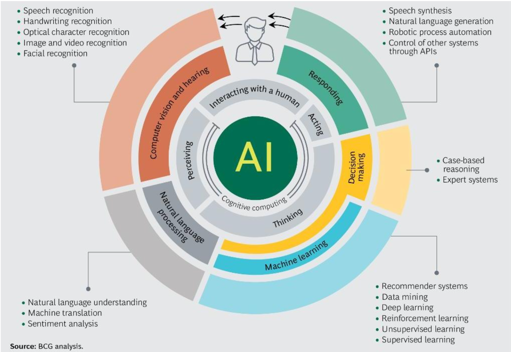
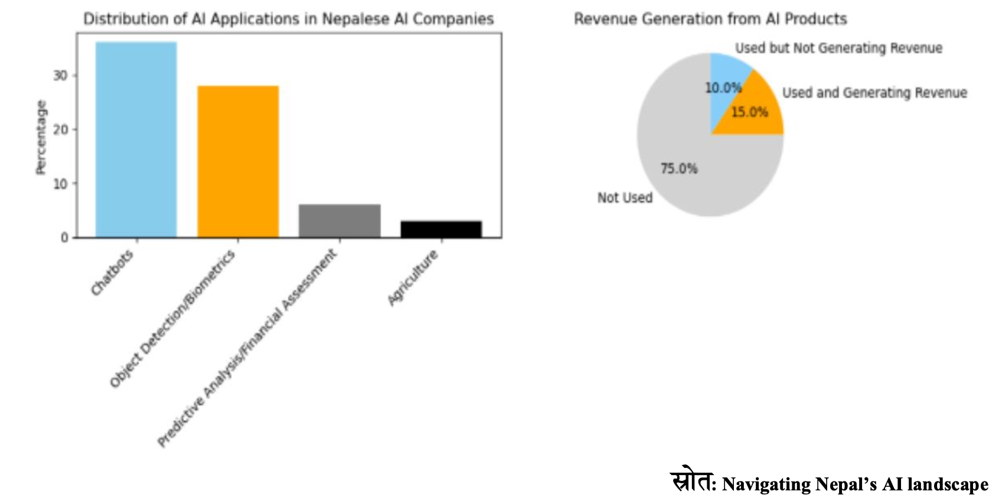
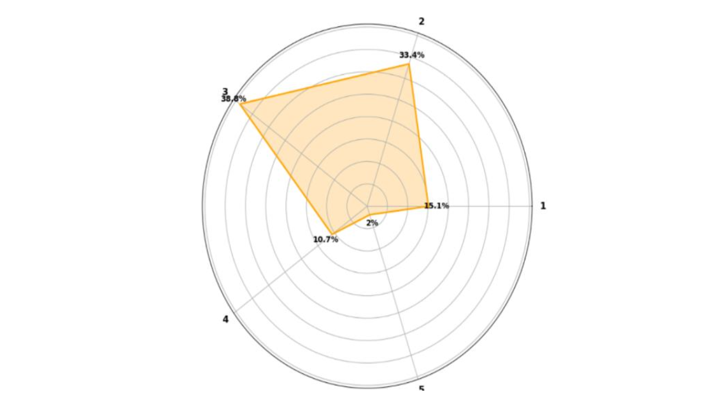
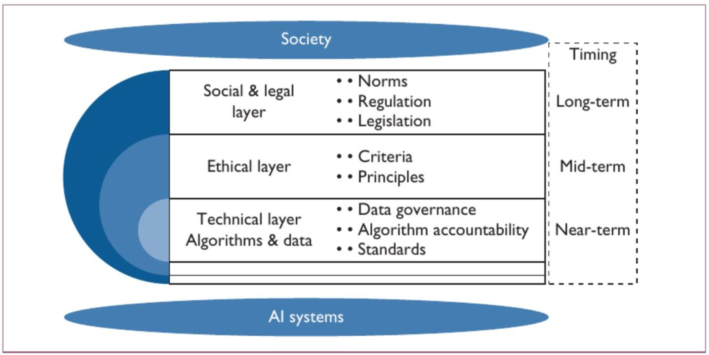
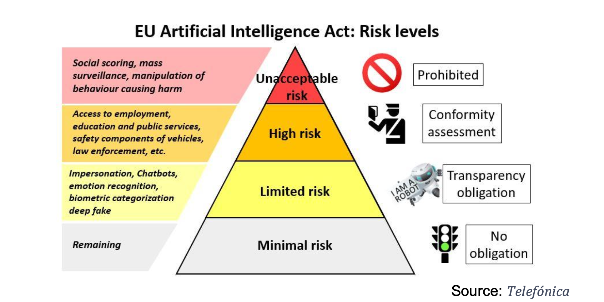
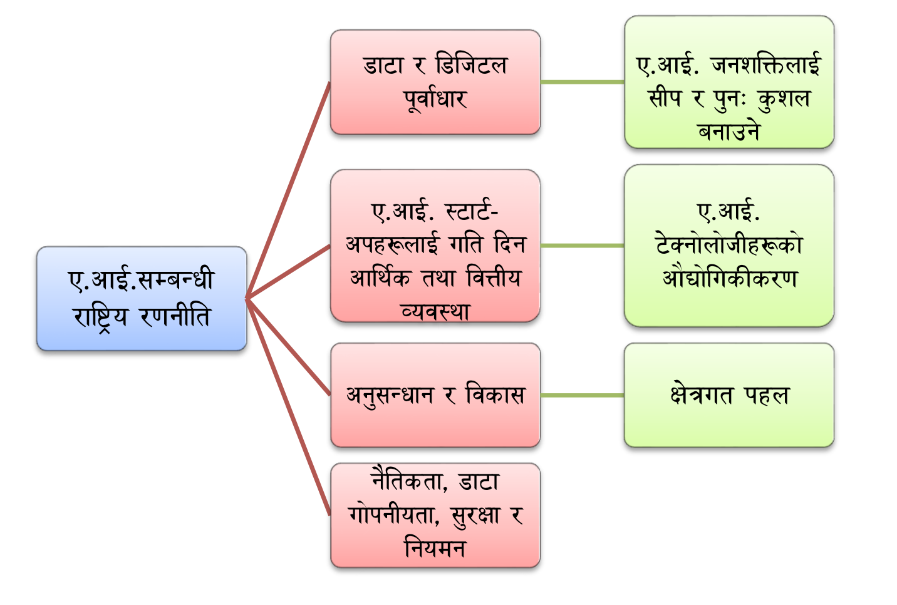
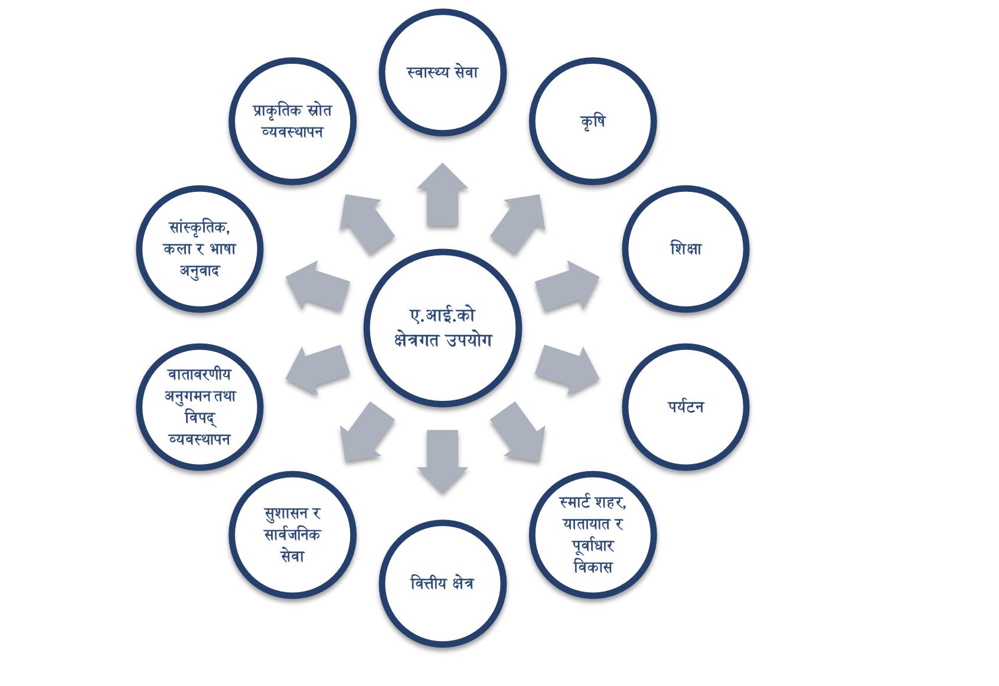

# Concept Paper on the Use and Application of Artificial Intelligence (AI) in Nepal

Original report: [नेपालमा आर्टिफिसियल इन्टेलिजेन्स (ए.आई.) को प्रयोग एवं अभ्यास सम्बन्धी](https://github.com/anilkumarshrestha/AI-concept-paper-nepal/blob/main/original-paper/AI%20Concept%20Paper_MoCIT.pdf)

Date of original publication: 2081/03/16

Last edit (translated verion): 2024/06/09

_NOTE: This is a community translated version of AI concept paper of Nepal and is maintained at [https://github.com/anilkumarshrestha/AI-concept-paper-nepal](https://github.com/anilkumarshrestha/AI-concept-paper-nepal). **This translation should not be considered an official report.**_

## Table of Contents

[Summary of Activities](#summary-of-activities)

1. [Summary](#1-summary)
2. [Concept of Artificial Intelligence](#2-concept-of-artificial-intelligence)
3. [Perspective](#3-perspective)
4. [Objectives](#4-objectives)
5. [Current State](#5-current-state)
6. [Regulatory Arrangements](#6-regulatory-arrangements)
7. [Institutional and Utilization Arrangements](#7-institutional-and-utilization-arrangements)
8. [International Practices](#8-international-practices)
9. [Opportunities](#9-opportunities)
10. [Problems and Challenges](#10-problems-and-challenges)
11. [Risks](#11-risks)
12. [Future Directions](#12-future-directions)
13. [Implementation Plan](#13-implementation-plan)
14. [Partnership](#14-partnership)
15. [Scope of Study](#15-scope-of-study)
16. [Conclusion](#16-conclusion)

[Reference Materials](#reference-materials)

## Summary of Activities:

Artificial Intelligence (AI), which translates to "Artificial Intelligence" in Nepali, is a computer-based system that mimics human behavior. In recent years, artificial intelligence has become increasingly popular among governmental organizations, private institutions, and the general public. The term AI came into use in the mid-20th century, but efforts to create intelligent systems have been ongoing for much longer. Historical Greek stories mention the Greeks using mechanical guardians, indicating early use of AI. However, the actual impact of AI began in 1950 when Alan Turing proposed the "The Imitation Game" to test machine intelligence. In 1960, Joseph Weizenbaum created "Eliza," the first general-purpose AI, designed to facilitate conversations and allow machines to communicate with humans, marking a significant milestone as the first computer program to pass the Turing Test.

Since then, there has been extensive growth and expansion in the field of AI. The emergence of new technologies and telecommunications has made AI more effective with innovations like Open AI and Generative AI, which are predicted to bring positive changes to human lifestyles. Globally, most technological sectors are focusing on AI research and development, employing new technologies like machine learning and deep learning daily.

Nepal is not far behind in the systematic use and application of AI. Kathmandu University and Tribhuvan University's Institute of Engineering are conducting studies and running various projects related to AI while publishing research papers. Some government bodies are experimenting with chatbots. In the private sector, startups are working in the fields of AI and machine learning. However, in the context of Nepal, there are various challenges in developing and utilizing AI. These include a lack of skills, experience, and experts in the field, obstacles in accessing data for implementation, a lack of a positive ecosystem, low literacy levels, and high costs.

The lack of necessity, data security, and privacy-related policies and legal frameworks, along with insufficient research and coordination on the development and use of AI, are identified as some of the challenges. To address the development, use, and regulation of AI, proactive measures should be taken from respective fields.

Firstly, the government should establish policies, laws, and procedures related to artificial intelligence. Cybersecurity, data protection, and privacy issues need to be addressed with appropriate policies. The adoption of standards and legal frameworks compatible with AI technology is crucial for its use. This includes creating a national AI strategy, data protection frameworks, and ensuring the confidentiality and security of AI usage, following international standards.

The formation of a governance structure for AI, promoting and regulating the developers and designers to adhere to national and international standards, is necessary. As AI is an interdisciplinary subject, coordination among all relevant bodies is required for effective promotion and regulation. Establishing dedicated institutions for AI governance, promoting self-regulation, and forming technological standards and frameworks are necessary steps.

Developing a unified national portal for AI-related data exchange and creating a collaborative framework are important. Research, development, and prioritization of AI usage should be enhanced with an emphasis on privacy protection, transparency, and accountability. Investment and policies encouraging AI research and development are needed. Implementing training programs to support AI usage in various fields should be prioritized.

Various sectors should incorporate AI in their policies, strategies, and programs, promoting its development and usage. Leveraging AI's transformative potential for economic and social development should be a priority. Adequate digital infrastructure and research support are essential. Continuous improvement of AI applications and its integration into economic and social problem-solving initiatives should be encouraged.

Digital literacy programs related to AI usage and effective implementation are necessary. Reskilling and upskilling existing workforces, along with training programs, should be given priority. The availability of skilled human resources in public and private sectors will facilitate AI development, usage, and promotion. Therefore, human capital development in this sector requires focused attention.

This report should be made available on the ministry's website and through various other channels to collect feedback and suggestions for further implementation.

## 1. Summary:

Artificial Intelligence (AI) translates to "Kritrim Buddhimatta" in Nepali, which means an artificial intelligence system based on machinery that mimics human behavior. In recent years, AI has become one of the popular subjects among government, private sectors, and the general public. Although the term AI came into use in the mid-20th century, efforts to create intelligent systems have been ongoing for much longer. Ancient Greek myths mention the use of mechanical guardians, indicating early concepts of AI. However, the actual influence of AI began in 1950 when Alan Turing proposed the "The Imitation Game" to test machine intelligence. In 1960, Joseph Weizenbaum created "Eliza," the first general-purpose AI designed for communication, enabling machines to interact with humans. Eliza became the first computer program to pass the Turing Test.

Since then, there has been significant development and expansion in the field of AI. Innovations like Open AI, Generative AI, and Quantum AI are transforming personalized services, security, healthcare, education, research, and economic growth, indicating a positive change in human society. AI technology allows machines to perform cognitive functions such as learning, reasoning, problem-solving, and decision-making by collecting and aggregating data, enhancing computational capabilities.

This evolution brings new opportunities and challenges. AI is reshaping human life by dramatically expanding and refining its capabilities and applications beyond its initial concept of mimicking human intelligence. The advancement in data processing, analysis, and calculation capabilities is aiding in problem-solving and productivity improvement, indicating that AI's scope and applicability continue to grow.

For a developing economy like Nepal, utilizing innovative technologies such as AI can be highly beneficial for rapid development. This would allow Nepal to bridge the gap with developed countries, fostering cooperation, competition, and participation on a global scale. The Government of Nepal has declared the fiscal year 2081-82 as the starting point for a decade of digital technology. Prioritizing digital technology, the aim is to achieve economic and social development goals through the use of advanced AI technology. To transform the economy, it is essential to focus on the potential of AI and align it with Nepal's needs by adopting effective strategies and policies. This would involve conducting research and development in AI and implementing various programs accordingly.

## 2. Concept of Artificial Intelligence:

Artificial Intelligence (AI) refers to the science and development of systems based on principles of cognitive science, computer science, neuroscience, engineering, and linguistics, aimed at enabling machines to perform tasks that typically require human intelligence. Artificial Intelligence is broadly categorized into two main types based on its capabilities:

1. **Narrow AI (ANI)**: This type of AI is designed for specific tasks and operates within a predefined scope of functionalities. Examples include virtual assistants like Siri or Alexa, and automated systems in various industries.
2. **General AI (AGI)**: General AI refers to AI systems that possess human-like cognitive abilities and are capable of learning, reasoning, making decisions autonomously, and performing tasks independently. General AI represents a theoretical concept and practical examples are yet to be fully realized. Advanced AI models like OpenAI's GPT-4 are pushing towards achieving capabilities closer to General AI, particularly in natural language processing and cognitive tasks.
3. **SuperAI:** This is a conceptual AI capable of surpassing human abilities in various domains. It is capable of problem-solving, self-awareness, emotional intelligence, and independently performing tasks in a superior manner to human intervention. SuperAI systems aim to persist and evolve in various fields such as aviation, where both general AI and SuperAI are crucial for future developments and advancements.

### 2.1) Importance of AI:

AI's application revolves around developing expert systems that emulate human intelligence to perform tasks such as reasoning, learning, decision-making, interpretation, and explanation, surpassing human capabilities in various domains. The significance of AI can be understood through the following perspectives:

- **Automation and Efficiency:** AI streamlines processes, making them more efficient by handling repetitive tasks, thus freeing up human resources for more complex and creative endeavors. AI systems minimize errors and optimize workflows effectively.
- **Data Analysis and Insights:** AI analyzes vast amounts of data quickly and comprehensively, uncovering patterns, trends, and hidden insights that human analysis may overlook. Data-driven insights are crucial for informed decision-making and strategic planning.
- **Pattern Recognition and Algorithm Improvement:** AI excels in recognizing patterns and refining algorithms, which enhances its own capabilities over time. This ability allows AI systems to continually improve and adapt to new challenges.
- **Adding Intelligence:** AI enhances products, processes, and systems by providing personalized recommendations and optimizing user experiences. For instance, AI-driven chatbots assist customers efficiently, while AI algorithms enhance performance in various applications.
- **Resource Efficiency:** AI contributes to resource conservation by optimizing processes and minimizing waste. This results in cost savings and environmental benefits through efficient resource management and sustainable practices.
- **Self-Adaptive Nature Development:** AI's ability to self-train and adapt to changing environments enables it to continuously evolve. This self-learning capability supports ongoing advancements in AI technology and applications.

AI and robotics applications encompass various types of innovations and applications. Figure 1 illustrates AI's expansive scope and the visualization of potential applications. At the core is cognitive computing, which utilizes diverse AI capabilities as a foundation. These capabilities are deployed in various fields such as medical diagnostics, education, security, and industry. AI advancements contribute to system refinement by minimizing errors and utilizing computational methods to enhance language processing. Machine learning algorithms enable AI to learn from data, supporting recommender systems, data mining, and deep learning applications. AI also employs case-based reasoning and expert systems to aid human experts. Speech synthesis generates automated processes and facilitates API systems to manage operations efficiently. These advancements profoundly impact communication and emotional connections, enhancing natural language production and processing capabilities. Highlighted in Figure 1 are the significant impacts and extensive capabilities of AI and robotics advancements.

Figure 1

In addition, AI implements advanced functionalities such as automation, data analysis, algorithm improvement, adding intelligence, and resource efficiency, effectively enhancing productivity and leveraging these innovative capabilities in various industries.

### 2.2) AI Ecosystem

AI represents a profound advancement that influences diverse and dynamic sectors such as industry, commerce, environmental and societal contributions. Its predictive analytics, operations, and strategic insights personalize enterprises, enhancing operational efficiency. Industries such as healthcare, agriculture, education, finance, logistics, manufacturing, energy, transportation, environmental management, disaster response, climate adaptation, and resource conservation benefit significantly from AI's impactful outcomes in economic and environmental contexts.

In this context, the establishment of legal and regulatory frameworks is crucial for the ethical deployment, protection, and governance of AI systems. Monitoring and assessing data usage and potential risks are critical aspects in integrating sectors into the ecosystem, aiming to further refine and utilize their transformative potential.

### 2.3) Foundations of AI

At a recent session, the Director-General of UNESCO underscored the profound potential and challenges of artificial intelligence (AI) at the intersection of technology, science, and risk management. The symposium highlighted the imperative to responsibly harness AI's capabilities and address its ethical implications for societal benefit. UNESCO's proclamation regarding the foundational principles of AI includes:

1. The application of AI systems should prioritize "necessary and proportionate" measures. Avoiding their use for competitive or malicious purposes is paramount.
2. AI systems should be developed through participatory methodologies, ensuring consideration of ethical and environmental impacts to promote human welfare.
3. Stakeholders involved in AI initiatives should ensure inclusive practices, minimizing bias and fostering equitable benefits.
4. AI technologies should be leveraged to safeguard human, economic, scientific, cultural, and environmental interests, aligning with global sustainable development objectives.
5. Continuous evaluation and regulation of AI technologies are essential to mitigate potential risks and ensure compliance with international standards.
6. Transparent and accountable practices in AI development should uphold democratic values, human rights, and cultural diversity, fostering societal trust and cohesion.
7. Governments should collaborate internationally to manage cross-border data flows responsibly, balancing innovation with privacy and security concerns.
8. Rigorous testing and impact assessments should precede the deployment of AI applications to enhance their reliability and societal impact.
9. Education and capacity-building efforts are crucial to prepare stakeholders for AI integration, ensuring readiness to maximize its transformative potential while addressing associated challenges.
10. States must adopt effective legal and technical measures to safeguard data sovereignty and privacy rights, ensuring that data usage aligns with ethical principles and regulatory frameworks.

## 3. Perspective:

Utilize AI in various fields to build a sustainable AI ecosystem and achieve economic and social transformation through AI.

## 4. Objectives:

- Promote AI-related research, innovation, development, and application while controlling potential risks through necessary policies and institutional frameworks.
- Develop digital public service infrastructure by using AI in integrated technology systems and electronic services to provide citizens with convenient and efficient public services.
- Increase productivity in the industrial sector through widespread AI application.
- Identify opportunities at national and international levels and implement mechanisms to evaluate and monitor the impact and growth of AI initiatives in Nepal.
- Establish a robust AI ecosystem in Nepal, promoting research, education, and industrial development.
- Ensure responsible AI practices, establish ethical guidelines, and mitigate risks while raising public awareness.
- Support companies producing AI-based robots and other devices, providing incentives and implementing regulatory measures regarding quality standards and operations.

## 5. Current State:

Most people and organizations working in various technology sectors globally are now focusing on artificial intelligence (AI) research and development. They are continually developing new algorithms like machine learning and deep learning, resulting in new applications daily. Significant progress is visible in the AI sector. AI is actively integrated into technologies like smartphones, TikTok, and other social media. AI is extensively used in the entertainment industry, such as analyzing user data to provide personalized content recommendations, as seen with Netflix. AI's medical applications include analyzing large datasets of medical records to enhance diagnostic accuracy, supporting doctors' decision-making processes. In finance, AI-driven analytics help in investment, lending, and risk management by processing large amounts of data from various sources.

While AI's positive impact is evident, it has also presented challenges. In the realm of computer technology, generative design tools powered by AI can produce designs at scale, sometimes leading to intellectual property infringement. Similarly, large-scale data collection and processing by AI can lead to potential breaches of intellectual property rights, raising legal concerns. AI-based data analytics systems can unknowingly or intentionally expose personal information or company trade secrets. Companies need to establish and enforce data protection measures to ensure that AI systems are not held accountable for any data breaches. Addressing AI's ethical implications is crucial. For example, AI systems might make decisions based on biases related to race, gender, or age. Ensuring that AI algorithms are "fair" and not biased against any specific group is vital. AI bias must be addressed during data pre-processing, system development, and deployment phases.

Large companies globally have started using AI, sometimes leading to job cuts. The issue of proper data usage and content regulation remains globally contentious. In recent times, AI usage in Nepal has significantly increased, indicating that Nepal cannot remain isolated from the systematic use and application of artificial intelligence. Some private industries and startups are working on creating chatbots, natural language processing, and machine learning systems. Figure 2 illustrates the contribution of AI companies in Nepal to utilization growth and revenue generation.

Figure 2

Kathmandu University's Institute of Engineering and Language Processing Laboratory is currently implementing several projects and conducting related studies and research. Tribhuvan University's Institute of Engineering is also running numerous projects and research papers under the language model framework and offers AI elective courses. The Pulchok Robotics Club has been engaged for decades in automated robot manufacturing and related activities, and is currently researching AI-based automated robot production.

Various governmental agencies seem to be attempting to use chatbots. The Kathmandu University Center for Smart Systems and Artificial Intelligence Research Laboratory's primary activities include the initial detection and alert system for social safety, detection and monitoring system for vulnerable wild and stray domestic animals, personal identification and attendance tracking systems, automated vehicle plate recognition and parking management system, human-wildlife conflict management system, aerial image segmentation, crop disease detection systems, late blight forecasting mobile application, digital leaf color chart for urea optimization in paddy, and IoT and AI-based intelligent irrigation systems. Additionally, research is ongoing in the tourism, culture, and arts sectors on 3D modeling of Nepali temples and statues, colorization and digital expansion of old images of Nepal, and the preservation and cataloging of cultural artifacts. Emotional computing and linguistic analysis in Nepali song lyrics, large language models for recommendation systems, and EEG signal analysis with a graph neural network for medical and health fields are also being studied, including Wilms’ Tumor segmentation and dengue infection analysis.

Figure 3 presents the results of a survey conducted among 406 students by the Ministry of Education, Science, and Technology regarding their knowledge of AI.

Figure 3

In Nepal, AI is increasingly being used in the health sector. In 2023, the Silganga Eye Institute became the first in Nepal to use advanced robotic and AI systems, employing the ReLEx SMILE PRO system for eye surgeries, completing surgeries within 8 seconds. Various banks and financial institutions in Nepal have also started using AI-integrated chatbots and virtual assistants to provide customer service. During the COVID-19 pandemic, a team of professors and students from Nepal Engineering College (NEC) in Duwakot prepared a 'delivery robot' used by Shukraraj Tropical and Infectious Disease Hospital in Teku, Kathmandu to deliver medicine, water, and food to COVID-19 patients in the isolation ward.

## 6. Regulatory Arrangements:

AI is becoming an integral technology, and its use is gradually increasing in Nepal. There is currently no specific policy, law, or regulatory framework dedicated to AI in Nepal. However, various policies and laws that incorporate aspects of AI are as follows:

- The National Science, Technology, and Innovation Policy 2076 (2019) mentions the extensive use of emerging and advanced technologies like AI and robotics for rapid industrial and other sector development.
- The Digital Nepal Framework 2076 (2019) recognizes AI, robotics, and IoT as transformational technologies.
- The Data Protection Act, 2075 (2018) addresses privacy protection in data use and management, including AI.
- Ethical guidelines for health research in Nepal, 2019, and the UGC policy regarding research misconduct, 2018, exist but are not specific to AI.
- The draft of the Cyber Security Act 2081 (2024) includes provisions for the safe and appropriate use of AI.

## 7. Institutional and Utilization Arrangements:

As of today, the Nepalese government has not designated any specific agency to oversee AI use, management, and regulation. However, the Ministry of Communications and Information Technology has a significant role in the application, management, and regulation of AI.

- The Ministry of Education, Science, and Technology, along with universities and other stakeholders, have important roles in the research and development of advanced technologies like AI.
- The Digital Nepal Framework 2019, approved by the Council of Ministers on October 22, 2019, acknowledges the transformative potential of AI. The 15th Plan includes AI as a Game Changer Project, and its implementation is divided into long-term, medium-term, and short-term phases.
- Some private industries and startups in Nepal are developing chatbots, natural language processing, machine learning, and other AI projects.
- Universities’ computer engineering and computer science curricula at the undergraduate and postgraduate levels include AI courses. Kathmandu University has been running AI programs since 2021 in its B.Tech and M.Tech programs.
- Some government agencies are also trying to use chatbots.

## 8. International Practices:

Many countries globally are utilizing AI for significant economic and social gains. For example, China and the United States project that by 2030, 26% and 10% of their GDP, respectively, will be derived from AI-related services and businesses. Various national and international strategies have been formulated for the development and utilization of AI.

### 8.1) International AI Strategies:

Various national and international strategies related to AI are being formulated and implemented worldwide. International strategies have been prepared and published by organizations such as the European Union and the United Nations. According to the OECD AI Policy Observatory, there are 69 different countries with a total of more than 1,000 national AI policies or strategies. In Nepal's context, AI-related policies and strategies are being formulated. Among the member countries of the South Asian Association for Regional Cooperation (SAARC), India has formulated 29 policies and strategies related to AI, while Bangladesh published the "National Strategy for Artificial Intelligence Bangladesh" in 2020. Other member countries have not yet formulated any policies or strategies related to AI.

### 8.2) Strategies of International Organizations

European Union, the United Nations, and other organizations have implemented international strategies for the safe and effective use of Artificial Intelligence. Some strategies are summarized in Table 1.

#### **Table 1: Strategies of International Organizations**

|                                                   |                                                                                                                                                                                                                                                                                                                                                                                                                                                                                                                                                                                                                                                                                                                                                                      |
| ------------------------------------------------- | -------------------------------------------------------------------------------------------------------------------------------------------------------------------------------------------------------------------------------------------------------------------------------------------------------------------------------------------------------------------------------------------------------------------------------------------------------------------------------------------------------------------------------------------------------------------------------------------------------------------------------------------------------------------------------------------------------------------------------------------------------------------- |
| **European Union**                                | In April 2018, the European Union Commission issued the AI Act, which regulates the use of Artificial Intelligence in communications. The aim is to regulate the development and use of AI technology in member states. By February 2, 2024, member states have approved the Act, which imposes restrictions on certain AI applications, mandates stringent regulations on high-risk AI uses, and emphasizes transparency and accountability in advanced AI models. This Act is notable as the world's first binding AI regulation, reinforcing the EU's proactive stance on AI governance. The Act sets global standards, known as the "Brussels effect," where EU standards influence worldwide norms due to the interconnected nature of markets and regulations. |
| **United Nations**                                | The UN's efforts in AI, through ITU and 46 UN agencies, are documented in the 2023 AI for Good Global Summit report. It provides insights into various innovative activities related to AI within the UN system. Numerous initiatives are highlighted, supporting AI's alignment with the Sustainable Development Goals (SDGs).                                                                                                                                                                                                                                                                                                                                                                                                                                      |
| **Nordic-Baltic Region**                          | Ministers from the Nordic-Baltic Region (Denmark, Estonia, Finland, Faroe Islands, Iceland, Latvia, Lithuania, Norway, Sweden, and Åland Islands) issued a declaration in May 2018 to collaborate in the field of AI.                                                                                                                                                                                                                                                                                                                                                                                                                                                                                                                                                |
| **UAE-India AI Agreement**                        | In July 2018, the UAE's AI Minister and Invest India signed an MoU to leverage Artificial Intelligence for economic growth in both countries.                                                                                                                                                                                                                                                                                                                                                                                                                                                                                                                                                                                                                        |
| **International Study Group of AI**               | France and Canada formed an international study group on AI to explore its scope and implementation.                                                                                                                                                                                                                                                                                                                                                                                                                                                                                                                                                                                                                                                                 |
| **Charlevoix Common Vision for the Future of AI** | At Charlevoix, Canada, G7 leaders endorsed their shared commitments on AI.                                                                                                                                                                                                                                                                                                                                                                                                                                                                                                                                                                                                                                                                                           |

### **8.3) National AI Strategies of Various Countries**

For the safe and effective use of Artificial Intelligence (AI), various countries are formulating national policies and strategies according to their national requirements. France published an AI strategy in 2017 and a policy on Artificial Intelligence in 2018. It is found that there has been significant progress in promoting AI startups, focusing primarily on health, environment, transportation, and defense sectors. These efforts are accompanied by ensuring data availability, emphasizing reskilling of workers, and mobilizing commercial resources. To ensure innovation and development in the AI sector, the private sector has established an Innovation Sandbox where safe experimentation and testing can take place.

China issued its AI strategy in 2017. It is centered around AI in education, health, transportation, energy, Internet of Things (IoT), robotics, urban planning, and improving the quality of life. There is a strong emphasis on sufficient financial support, the development of a talent pipeline, and international cooperation to advance and expand AI applications in commercial services. Major companies like Baidu, Alibaba, and Tencent have developed open-source innovation platforms to lead AI development and expansion. The country has also focused on the expansion of 5G networks, supercomputers, and high-capacity semiconductor chips to build AI infrastructure.

The United States published its AI Industrial Strategy in November 2017. This strategy aims to expand the use of AI in agriculture and commercial service delivery, fostering the development of innovative technology industries, and promoting private sector collaboration. The strategy emphasizes creating a data trust environment by managing data sharing and storage, and building infrastructure such as 5G networks, software-defined networks, and full-fiber networks for AI applications.

Japan is transitioning from the Industry 4.0 concept to Society 5.0 by bringing efficiency to commercial services through AI. It is advancing AI in education, health, banking, and cybersecurity sectors with high priority. Japan has also announced programs to promote research and development in AI and big data through tax incentives and grants for manufacturing robots using AI.

India implemented its National Strategy for Artificial Intelligence in June 2018. The strategy aims to lead inclusive technological development with AI, focusing on economic growth, social development, and inclusive progress, particularly in health services, agriculture, education, smart cities, and transportation sectors. It addresses challenges such as expertise shortages, data ecosystem, resource allocation, privacy, and security. The strategy proposes ethical considerations to ensure responsible and beneficial AI usage through a two-tiered research approach and market models for adopting AI in deep and cross-disciplinary applications.

Bangladesh has implemented its National Strategy for Artificial Intelligence, 2020, to accelerate its digitalization efforts and transformative activities across various sectors. Bangladesh aims to double its economic growth rate and increase labor productivity through significant investments in IT infrastructure, such as high-tech parks, technology parks, and data centers, leveraging 5G, robotics, big data, blockchain, and IoT technologies. Despite challenges like employment management, Bangladesh prioritizes embracing the Fourth Industrial Revolution, creating new employment opportunities, and achieving SDG goals using AI. The strategy outlines five priority areas for AI implementation: research, skills development, data infrastructure, ethics, startup funding, and industrialization, with a roadmap for sustainable AI development over the next five years. The expectation is that Bangladesh will navigate towards good governance practices embedded with AI to address challenges like data access, skilled workforce shortages, economic impacts, security, and ethics.

In European countries, AI is prioritized in health services, transportation, finance, manufacturing, agriculture, small industries, education, and environmental monitoring. National strategies formulated by other countries are presented in this document.

#### Table 2

| **Country** | **Strategy/Plan**                             | **Details**                                                                                                                                                                                                                                                                                                                                                                                                                                                                                                                                                                                   |
| ----------- | --------------------------------------------- | --------------------------------------------------------------------------------------------------------------------------------------------------------------------------------------------------------------------------------------------------------------------------------------------------------------------------------------------------------------------------------------------------------------------------------------------------------------------------------------------------------------------------------------------------------------------------------------------- |
| Argentina   | National Plan of Artificial Intelligence      | The Ministry of Education, Culture, Science, and Technology of Argentina is working on the national AI plan. The plan aims to fulfill Argentina's digital agenda by 2030 and establish a National AI Innovation Hub.                                                                                                                                                                                                                                                                                                                                                                          |
| Australia   | AI Roadmap                                    | Released in November 2019, the AI Roadmap focuses on improving technological expertise in health, infrastructure, and natural resources. Australia plans to create 161,000 additional AI specialist jobs by 2030, contributing an estimated $315 billion to the economy by 2028.                                                                                                                                                                                                                                                                                                              |
| Austria     | AIM at 2030                                   | In June 2019, Austria's government launched the AI Mission Austria 2030 as its strategic AI initiative. It covers areas like research and innovation, society, security and law, ethics, labor market, skills and training, AI governance, infrastructure, industry use of AI, and economic application of AI.                                                                                                                                                                                                                                                                                |
| Brazil      | Consultation Period                           | On January 31, 2020, Brazil's Ministry of Science, Technology, Innovation, and Communications (MCTIC) started public consultation for the National AI Strategy. The strategy focuses on digital future skills, research, development, innovation, entrepreneurship, and industrial and commercial security applications of AI.                                                                                                                                                                                                                                                                |
| Belgium     | AI for Belgium                                | In March 2019, Belgium launched its national AI strategy, "AI for Belgium". It aims to promote ethics, regulation, deep and broad skills, provide a Belgian AI catalog, support the Belgian AI community, secure EU funding and connectivity, propose comprehensive training, and develop AI-based new products and services.                                                                                                                                                                                                                                                                 |
| Canada      | Pan-Canadian Artificial Intelligence Strategy | Announced in 2017, Canada was the first country to release a national AI strategy. With a five-year budget of CAD 125 million, it focuses on AI research and training through the Canadian Institute for Advanced Research (CIFAR), in partnership with three new AI institutes in Edmonton, Toronto, and Montreal.                                                                                                                                                                                                                                                                           |
| Chile       | National Policy on Artificial Intelligence    | Released in 2021, Chile's national AI policy developed by the Ministry of Science, Technology, Knowledge, and Innovation focuses on enabling factors, technology application, ethical and security aspects. It includes 70 strategic actions and 185 initiatives over ten years with a $26 billion investment, aiming to position Chile as a leader in AI development.                                                                                                                                                                                                                        |
| China       | National New Generation AI Plan               | Launched in July 2017, China's ambitious plan aims to lead the world in AI theories, technologies, and applications. The plan outlines the goal to align with global AI industries by 2020, become a world leader in certain AI fields by 2025, and make China the primary AI innovation center by 2030. The plan includes a 10 trillion RMB industry and investment in various sectors like agriculture, defense, education, employment, health, and more.                                                                                                                                   |
| Denmark     | Digital Growth Strategy                       | Initiated in January 2018, Denmark's digital growth strategy aims to position the country as a leader in digital transformation, promoting citizen development and prosperity. It focuses on AI, big data, and IoT, supporting businesses in their digital transformation. The plan allocates annual funding of DKK 125 million until 2025, followed by DKK 75 million, including initiatives for digital skills and cybersecurity.                                                                                                                                                           |
| Finland     | AI Strategy                                   | Launched in May 2017, Finland aims to lead in AI technology applications. A steering group was formed to guide the effort, releasing two reports in April 2019. The first report assessed Finland's AI strengths and weaknesses, proposing the establishment of AI centers, an accelerator pilot program, and integrating AI into business services. The second report suggested 28 policy recommendations for economic growth and employment, labor market, education, and ethics.                                                                                                           |
| France      | AI Strategy                                   | Under President Emmanuel Macron's leadership, France announced a €1.5 billion plan to establish the country as a global leader in AI research, training, and industry. The plan, inspired by a report from the "AI for Humanity" mission led by Cédric Villani, includes strengthening the AI ecosystem, attracting international talent, developing open data policies, supporting domestic AI champions, and establishing ethical regulations. Investments focus on sectors like healthcare and transportation.                                                                             |
| Germany     | AI Strategy                                   | Germany aims to enhance and expand AI research, with a focus on transferring results to the private sector and creating AI applications. The plan includes new research centers, international partnerships, regional clusters, and support for SMEs and startups. Germany wants to integrate AI into public services, make commercial data more accessible, and promote transparent and ethical AI. Initiatives like Industry 4.0 and smart services are part of the strategy. Institutions like the German Research Center for AI and the Alexander von Humboldt Foundation play key roles. |
| Italy       | AI White Paper                                | Released in March 2018, Italy's white paper on AI integration in public services identifies ethical, skilled workforce, data, and legal challenges. It proposes ten recommendations. A consortium of universities and research centers formed a national AI lab in July 2018 to promote research, technology transfer, and AI in industrial administration.                                                                                                                                                                                                                                   |
| India       | National Strategy on AI, 2018                 | India's strategy "AI for All" focuses on inclusive growth through AI, in line with the government's policy of inclusive development. It aims to develop the research ecosystem, promote adoption, and address AI skill gaps in the population. The strategy prioritizes research in agriculture, healthcare, and education.                                                                                                                                                                                                                                                                   |
| Japan       | AI Strategy, 2019                             | Developed to contribute to global solutions through Society 5.0, the strategy aims to create a conducive environment for AI, including generative AI, and address societal issues in Japan. The strategy focuses on development, education, exploration, and science and technology sectors.                                                                                                                                                                                                                                                                                                  |
| Singapore   | National AI Strategy, 2019                    | Aiming to position Singapore as a leader in AI by 2030, the strategy involves developing AI systems and applying them across sectors such as healthcare, transportation, smart cities, and finance. The strategy focuses on building AI capabilities and governance frameworks.                                                                                                                                                                                                                                                                                                               |

#### Table 3

| Country     | Number of AI Policies/Strategies | Current AI Strategy                    |
| ----------- | -------------------------------- | -------------------------------------- |
| India       | 29                               | National Strategy on AI (2018)         |
| Japan       | 26                               | AI Strategy (2019)                     |
| China       | 22                               | National New Generation AI Plan (2017) |
| Singapore   | 25                               | National AI Strategy (2019)            |
| South Korea | 14                               | National Strategy for AI (2020)        |

The AI Governance principles and frameworks have been formulated in collaboration with the policymakers. These frameworks are progressing in Nepal and are useful for developing AI-related policies and regulations. In 2017, Harvard University's Berkman Klein Center for Internet and Society developed a Layered Model for AI Governance that outlines three layers:

1. Social and Legal Layer
2. Ethical Layer
3. Technical Layer (Algorithms and Data)

Source: [Harvard Berkman Klein Centre Report](https://dash.harvard.edu/bitstream/handle/1/34390353/w6gov-18-LATEX.pdf)

Figure 4 A layered model for AI governance

These layers interact with society and the external factors influenced by AI. The model emphasizes creating standards and principles for AI algorithms in the short term and developing regulations for AI applications in the medium and long term. Similarly, Singapore's Model AI Governance Framework, implemented in 2019, outlines two guiding principles:

1. AI-based decision-making processes must be explainable, transparent, and fair.
2. AI software must be human-centric.

Based on this framework, Singapore created the AI Governance Testing Framework and Toolkit on May 25, 2022, named AI Verify.

## 9. Opportunities

Artificial Intelligence provides special opportunities in various sectors. The main opportunities are as follows:

- Health, disease prevention, and treatment: AI assists in analyzing medical data, predicting diseases, studying drug alternatives and outcomes. It improves digital health services and helps find new methods for disease prevention and treatment.
- Financial services and analysis: AI helps in financial services by providing investment advice, monitoring financial transactions, and enhancing investment decisions.
- Manufacturing and production: AI aids in construction, production control, improving industrial processes, and increasing productivity.
- Education and development: AI is integrated into learning and teaching processes to make learning more effective for students of different abilities and automates administrative tasks to allow teachers more interaction with students.
- Commerce and customer experience enhancement: AI is used in the commercial sector for customer service, marketing, and commerce. It interacts with customers to improve their experience.
- Organizational management: AI offers various opportunities in organizational management, including data exchange, operations management, leadership development, supervision, industrial quality control, and productivity enhancement.
- Public services: AI provides various opportunities in public services by improving service delivery, enhancing public security, ensuring regulation, and making decisions based on data analysis.
- Social security: AI offers various solutions in social security by reducing errors in decision-making, predicting based on data, and maintaining the confidentiality of individual and commercial information.
- Sports: AI offers various opportunities in sports, including analysis, simulation-based training, virtual reality, and broadcasting.
- Research and development: AI creates numerous opportunities in research and development, including concept exploration, experimentation, and innovation. Research and development is a key area for AI.
- Agriculture: As Nepal is an agricultural country, implementing AI-based irrigation systems helps increase productivity and identify problems early in crops to reduce losses.
- Tourism: AI improves tourism by offering personalized travel plans, virtual tour guides, security and surveillance systems, enhancing experiences, and analyzing data to improve tourism strategies.

## 10. Problems and Challenges:

In Nepal, the use of AI in commercial sectors is significantly low, and its application in the private sector is minimal. The main problems and challenges for effective AI implementation are:

- Lack of capacity, experience, and expertise in the development and use of AI
- Obstacles in accessing data and absence of an efficient data ecosystem for AI implementation
- Lack of literacy in the development and use of AI
- Need for high costs and resources for AI development and use
- Absence of regulatory and legal frameworks for data security and privacy
- Insufficient coordination and support for AI development and use
- Use of imported technologies due to lack of local AI systems, leading to data security and privacy issues
- Ensuring impartiality and ethical standards
- Ensuring transparency, accountability, and responsibility
- Lack of effective research and development for AI due to insufficient financial support
- Shortage of necessary research for effective AI implementation
- Lack of computational resources for AI development and use in Nepal
- Lack of clear direction and priority areas from the government
- Absence of regulatory bodies for AI governance and lack of specific policies

These problems and challenges hinder the effective use and expansion of AI technology.

## 11. Risks:

AI poses risks to individual and intellectual property rights protected by Nepalese law. These risks can be physical or non-physical, including physical, mental, social, or economic impacts. The European Union's AI law classifies AI systems based on potential risks as illustrated in Figure 5.

Figure 5

#### Table 4

| Classification (Based on Risk Level) | Description                                                                                                      | Compliance Level | Examples of AI System Applications                                                                                                                                                                                                                                                                                                                                                                     |
| ------------------------------------ | ---------------------------------------------------------------------------------------------------------------- | ---------------- | ------------------------------------------------------------------------------------------------------------------------------------------------------------------------------------------------------------------------------------------------------------------------------------------------------------------------------------------------------------------------------------------------------ |
| Prohibited AI Systems                | Any AI system that poses an unacceptable risk to the safety and fundamental rights of people.                    | Prohibited       | These include AI used for social scoring, which affects behaviors, emotional recognition systems in workplaces, predictive analysis of sensitive data, biometric classification, and any AI system that exploits vulnerabilities of individuals or specific groups (like children, elderly, or disabled people) to harm, control, or manipulate them in a way that negatively impacts their free will. |
| High-Risk AI Systems                 | AI systems that need prior approval: Before being used, these systems must be tested to ensure they are safe.    | High Risk        | Important safety systems: biometric identification and surveillance systems, security components in law enforcement (e.g., criminal detection tools, vehicle/driver systems), access to essential private and public services (e.g., loan eligibility, benefits, health and life insurance), and critical infrastructure security (e.g., energy, transportation).                                      |
| Minimal Risk AI Systems              | AI systems that require: Transparent and accountable operations due to minimal risk posed.                       | Minimal Risk     | A limited number of AI systems directly interacting with individuals (e.g., chatbots), visual or audio deepfake content generated or viewed by AI systems.                                                                                                                                                                                                                                             |
| Low Risk AI Systems                  | AI systems that can be used without the need for additional AI-specific legal requirements, posing minimal risk. | Low Risk         | AI systems that do not fall into the above categories, such as photo editing software, product recommendation systems, spam filtering software, and game creation software.                                                                                                                                                                                                                            |

## **12. Future Directions:**

#### **12.1) AI Policy and Legal Framework**

##### **12.1.1) Policy Framework for AI**

It is necessary to establish the following provisions for the safe, secure, and effective use of Artificial Intelligence:

- Transparency and accountability regarding the technology and algorithms used in AI.
- Addressing intellectual property issues related to the use and application of AI.
- Technical infrastructure, human resources, and capacity building necessary for the use and regulation of AI.
- Legal provisions concerning the import and export of AI technology.
- Appropriate measures to address issues related to information integrity, misinformation, and disinformation in AI.
- Data protection related to maintaining the privacy and security of individual and organizational data.
- Usage of platforms and data concerning AI.
- Utilization of AI for national needs and economic development.
- Developing technical capacities and skilling and reskilling the workforce for AI applications.
- Identifying key policy enablers for the use of AI.
- Addressing cyber security and ethical issues related to AI.

##### **12.1.2) National Strategy for AI:**

A national strategy must be formulated to assess the current state of the AI ecosystem, identify potential areas for AI promotion, research and development capabilities, and chart a forward path. This strategy should include a comprehensive action plan for major sectors such as healthcare, agriculture, education, smart cities, and infrastructure, as well as smart mobility and transportation.

Figure 6

##### **12.1.3) Data Protection Framework**

Since AI involves the use of data, there is a risk of misuse of institutional and personal data. Therefore, it is essential to develop a legal framework for data protection to ensure the safe use of names, addresses, financial details, and sensitive information during the training of algorithms and capacity building. Aligning and benchmarking national data protection and privacy laws with international standards is also necessary.

##### **12.1.4) Sectoral Regulatory Framework:**

Given the varying impact of AI in different sectors, it is essential to develop and implement sectoral regulatory frameworks to ensure user privacy, security, and effective utilization of AI. Sectoral ministries and departments should establish necessary regulatory frameworks based on their requirements and mechanisms.

#### **12.2) Governance Structure**

##### **12.2.1) Establishment of a Dedicated Nodal Agency:**

A dedicated nodal agency must be established for the economic transformation, policy, and legal management, and planning related to the use of AI. This agency should include relevant stakeholders and experts in its working group.

##### **12.2.2) AI Standardization:**

The responsible agency, in coordination with other stakeholders, should establish standards related to:

- Functional architecture, data structures,
- Interoperability and protocols, technologies used, systems implemented, benchmarking practices,
- Development and use of reliable AI, digital rights, and ethical standards, protection of algorithm transparency, security, and compliance,
- Standardization of interoperability standards; achieving national goals through AI technological mapping and usage,
- Establishing standards/guidelines for the use of AI in industry,
- Development of an AI stack (such as Bharat AI Stack),
- Creating standards for AI use in citizen services and automated systems,
- Local agencies should coordinate with the Ministry of Communication and Information Technology, Department of Information Technology, Telecommunication Authority, and other agencies for ITU-T standardization activities.

##### **12.2.3) Development of a National Artificial Intelligence Portal:**

A national AI portal should be developed to serve as a one-stop digital platform for AI-related events, data, investments, resources, companies, and academic institutions in Nepal. This portal will share documents, case studies, research reports, etc., and provide information on AI learning, new opportunities, and insights.

##### **12.2.4) Development of National Projects**

Key national AI projects should be identified, and the deployment loop from problem definition to deployment should be effectively implemented. This will include investment in AI research, capability enhancement, leadership development, and the establishment of digital infrastructure.

#### **12.3) Digital Literacy on AI**

Digital literacy involves effectively communicating enhanced AI environments. It is crucial to provide responsible and skilled use of AI tools and services in personal use, workplace, or educational settings. Awareness must be raised about recent AI developments and how these advancements impact society, industry, and personal lives.

#### **12.4) Research and Development on AI:**

Research and development are essential for the growth and application of AI. Focus areas include:

- Promoting privacy protection, transparency, and accountability, increasing research, investment, and capacity-building on AI use,
- Establishing AI centers in academic institutions and industries for AI research and utilization,
- Encouraging academia-industry collaboration for AI research and development,
- Developing common computing infrastructure for AI research and development,
- Coordinating with international organizations for AI research and development.

#### **12.5) Utilization of AI**

Plans and programs must be formulated to promote the use of AI. These should include the exchange of data, inter-agency collaboration, literacy and awareness programs, creation of a conducive environment for startups, establishment of incubation hubs, and provision of venture funds. Schools, colleges, and universities should incorporate data science and AI-related subjects into their curricula. Existing professionals should be reskilled and upskilled through various means.

The responsible use of AI, adherence to standards, and legal compliance monitoring are necessary. Technological sustainability provisions must also be ensured. Nepal should leverage AI for economic and social development by formulating plans and programs in various sectors as outlined in this concept paper.

Figure 7

### **12.5.1) Health Services:**

Developing an early disease detection system, utilizing diagnostic imaging, and providing clinical decision support systems for medical professionals. Implementing telemedicine systems for virtual consultations and remote monitoring, applying AI-based health service solutions in rural areas with limited access to advanced healthcare facilities. Utilizing AI for precision medicine through genomics analysis, biomarker identification, and patient screening to tailor treatment plans and therapies according to individual genetic profiles, disease characteristics, and treatment processes.

    Developing AI-based clinical trial matching platforms to provide patients with information about their health status and potential experimental treatments based on their medical history and eligibility criteria. Bioinformatics plays a crucial role in genetic data science, including DNA sequencing and virus mutation rate analysis, aiding scientists in diagnosing diseases, developing treatments, and understanding disease progression. Analyzing virus mutation rates helps understand viral evolutionary changes and potential impacts.

### **12.5.2) Agriculture:**

Collecting data on soil quality, moisture levels, temperature, and crop health using sensors, drones, satellite imagery, and IoT devices. Analyzing collected data to detect crop growth, pest infestations, nutrient deficiencies, and other factors affecting crop management, using machine learning algorithms to develop AI-based decision support systems. Providing farmers with real-time information on planting schedules, irrigation times, fertilizer usage, pest control measures, and other agricultural practices to improve crop management, optimize resource use, and enhance productivity.

Using weather forecasting models, trained with historical weather data, real-time observations, and data from weather stations, satellites, and other sources, to predict temperature, rainfall, humidity, wind speed, and weather events. This helps farmers reduce the adverse impacts of unfavorable weather on crop production by providing important information on planting and irrigation timings, fertilizer usage, and pesticide application. AI tools help reduce excessive use of pesticides and nitrogen (urea) by forecasting disease outbreaks and improving agricultural practices based on weather and soil data. AI suggests climate-adaptive crops suitable for global climate change scenarios.

### **12.5.3) Education:**

Using AI in various systems to develop personalized learning experiences, adaptive learning platforms, and teaching styles and materials tailored to students' needs. Collecting data on students' learning behavior, preferences, strengths, and weaknesses, and using machine learning technologies to analyze this data and identify students' learning styles. Developing AI-based tutoring systems to interact with students in real time, answer questions, and provide explanations using natural language processing. Implementing adaptive learning platforms that adjust the difficulty level and content based on students' performance and progress, using algorithms to manage continuous learning.

Applying AI algorithms to provide personalized educational content, resources, and exercises based on students' learning objectives and preferences. Developing integrated learning management systems accessible anytime and anywhere using AI platforms. Regularly refining AI algorithms and systems by collecting feedback from students and teachers and monitoring performance metrics to optimize learning outcomes.

### **12.5.4) Tourism:**

Using AI to develop personalized travel planning and advisory systems, virtual tour guides, security and monitoring systems, experience enhancement, and data analysis to improve tourism experiences. AI algorithms provide personalized travel plans and suggestions based on tourists' interests and behavior, enhancing their experiences. Virtual tour guides and chatbots provide real-time information and recommendations to tourists, along with information about the history and significance of tourist sites. AI-based cameras and monitoring systems contribute to security management at tourist sites, managing crowds, and emergency response systems. Virtual and augmented reality technologies offer tourists digital experiences of historical sites, while translation tools remove language barriers. Analyzing data on tourist arrivals, interests, and behavior to develop tourism strategies and effective promotional measures.

### **12.5.5) Smart Cities, Transportation, and Infrastructure Development:**

AI plays a crucial role in developing smart cities and infrastructure by optimizing processes, increasing efficiency, and improving the quality of life. AI enhances traffic management systems by predicting crowd levels, optimizing energy management by reducing energy wastage, and improving waste management practices. AI contributes to commercial security by analyzing surveillance data and predicting equipment failures to improve infrastructure maintenance. Additionally, AI helps monitor environmental conditions by assessing air and water quality.

AI-based traffic management systems, smart logistics networks, and intelligent logistics solutions improve mobility, reduce congestion, and enhance overall transportation quality. AI significantly contributes to route management by analyzing traffic patterns, estimating congestion, and providing optimal route suggestions in real time, reducing traffic jams and enhancing overall traffic management efficiency. AI-based solutions help detect wildlife on transport routes using sensors and cameras. These systems identify various animals, alert authorities, or automatically reroute to prevent accidents.

### **12.5.6) Environmental Monitoring and Disaster Management:**

Using AI-based sensors and monitoring systems to measure and monitor air and water quality, identify pollution hotspots, and study climate change conditions. AI-based prediction and early warning systems help forecast natural disasters such as landslides, floods, and earthquakes, facilitating timely evacuation and disaster preparedness measures. Developing early fire detection and alert systems using AI to prevent and mitigate urban and forest fires. AI helps monitor climate factors affected by temperature, such as glacier size, forest area, river volume, flood rates, snow cover, and precipitation patterns, enabling necessary actions.

### **12.5.7) Natural Resource Management:**

AI aids conservation efforts by analyzing satellite imagery to monitor biodiversity, track wildlife populations, and combat illegal activities such as poaching and deforestation. Using AI to monitor river sand and stone extraction's impact on the environment, particularly soil erosion. AI helps reduce human-wildlife conflicts by predicting attacks by animals such as tigers and elephants near national parks and other protected areas, preventing damage by wild boars and monkeys in hilly regions.

### **12.5.8) Cultural, Art, and Language Translation:**

AI-based language translation tools facilitate communication between different linguistic communities, promoting cultural exchange and making tourism and international trade easier. Using AI platforms to promote local arts and culture and enhance tourist attractions, providing visitors with historical and cultural experiences of Nepal. Analyzing various cultural elements such as language, musical instruments, songs, and dances using AI to support the study and evaluation of rich historical heritage. This technology integration helps preserve and promote historical cultural exchange and provides tourists with an immersive cultural experience.

### **12.5.9) Financial Sector:**

AI-based fintech solutions expand access to financial services, facilitate mobile banking, provide credit scoring for underserved populations, and detect fraudulent activities, making the overall financial sector secure and reliable.

### **12.5.10) Governance and Commercial Services:**

Using AI to optimize government operations, enhance commercial service delivery, automate administrative tasks, and increase transparency and accountability in governance.

## 13. Implementation Plan

| No.   | Activities                                   | Responsible Agency                                                                          | Supporting Agency                                                                                                                                                    | Timeframe  | Expected Outcome                                                                                                                                           |
| ----- | -------------------------------------------- | ------------------------------------------------------------------------------------------- | -------------------------------------------------------------------------------------------------------------------------------------------------------------------- | ---------- | ---------------------------------------------------------------------------------------------------------------------------------------------------------- |
| 1     | Creation of Policies and Laws                |                                                                                             |                                                                                                                                                                      |            |                                                                                                                                                            |
| 1.1   | National AI Policy                           | Ministry of Communication and Information Technology                                        | Office of the Prime Minister and Council of Ministers, National Planning Commission, relevant ministries, Nepal Telecommunications Authority                         | 6 months   | Establishment of a legal framework for AI.                                                                                                                 |
| 1.2   | National AI Strategy                         | Ministry of Communication and Information Technology                                        | Office of the Prime Minister and Council of Ministers, National Planning Commission, relevant ministries, Nepal Telecommunications Authority                         | 1 year     | Development of a prioritized AI strategy.                                                                                                                  |
| 1.3   | AI Act                                       | Ministry of Communication and Information Technology                                        | Office of the Prime Minister and Council of Ministers, National Planning Commission, relevant ministries, Nepal Telecommunications Authority                         | 2 years    | Establishment of a legal foundation for AI.                                                                                                                |
| 1.4   | Data Protection Framework                    |                                                                                             |                                                                                                                                                                      |            |                                                                                                                                                            |
| 1.4.1 | Data Protection Policy                       | National Planning Commission (currently being prepared by the National Planning Commission) | Ministry of Communication and Information Technology, National Planning Commission, relevant ministries                                                              | 6 months   |                                                                                                                                                            |
| 1.4.2 | Data Protection Act                          | National Planning Commission                                                                | Office of the Prime Minister and Council of Ministers, Ministry of Communication and Information Technology, relevant ministries, Nepal Telecommunications Authority | 1 year     |                                                                                                                                                            |
| 1.5   | Sectoral AI Guidelines                       | Relevant Ministries                                                                         | Local bodies, Ministry of Communication and Information Technology, National Planning Commission                                                                     | 2 years    | Creation of sectoral guidelines based on needs.                                                                                                            |
| 2     | Establishment of Governance Framework        |                                                                                             |                                                                                                                                                                      |            |                                                                                                                                                            |
| 2.1   | Establishment of Dedicated Nodal Agency      | Ministry of Communication and Information Technology                                        | Office of the Prime Minister and Council of Ministers, National Planning Commission, Ministry of Federal Affairs and General Administration                          | 1 year     | Efficient coordination of all activities related to AI by the dedicated nodal agency.                                                                      |
| 2.2   | Development of Basic Infrastructure          | Relevant Ministries, Nepal Telecommunications Authority, Local bodies                       | Office of the Prime Minister and Council of Ministers, National Planning Commission, Ministry of Federal Affairs and General Administration                          | 3 years    | Development of necessary infrastructure for AI usage (e.g., IOT infrastructure, 5G/6G, Software Defined Network, Full Fibre Network, GPU Infrastructures). |
| 2.3   | Establishment of AI Standards                | Ministry of Communication and Information Technology (Nodal Agency)                         | Nepal Telecommunications Authority, National Planning Commission, relevant ministries                                                                                | 2 years    | Development of technical standards for AI usage.                                                                                                           |
| 2.4   | Development of Integrated National AI Portal | Ministry of Communication and Information Technology (Nodal Agency)                         | Nepal Telecommunications Authority, National Planning Commission, relevant ministries                                                                                | 3 years    | Availability of integrated information and resources related to AI.                                                                                        |
| 2.5   | Development of National Projects             | Ministry of Communication and Information Technology (Nodal Agency)                         | Ministry of Communication and Information Technology, relevant ministries, Nepal Telecommunications Authority                                                        | 3 years    | Development of research and supportive digital infrastructure related to AI.                                                                               |
| 3     | AI Literacy                                  | Nodal Agency, Relevant Ministries and Departments, Local bodies                             | Office of the Prime Minister and Council of Ministers, relevant ministries, Nepal Telecommunications Authority                                                       | Continuous | Awareness and knowledge about AI applications and usage.                                                                                                   |
| 4     | AI Research and Development                  | Universities, Ministry of Communication and Information Technology (Nodal Agency)           | Ministry of Education, Science, and Technology, Nepal Academy of Science and Technology                                                                              | Continuous | Identification of AI application areas and technologies.                                                                                                   |
| 5     | Utilization                                  | Government, Private Sector, Various Stakeholders                                            |                                                                                                                                                                      | Continuous | Enhanced use of AI in governance and administration.                                                                                                       |

## **14. Partnership:**

Since AI is an innovative technology in the field of information technology, it requires coordination and partnership with various stakeholders. Particularly, as AI usage needs to be regulated and made effective through proper governance, partnerships are crucial. Stakeholders will include government, telecommunication and information technology service providers, the community, and commercial, research, and academic institutions.

## **15. Scope of Study:**

Artificial Intelligence is an emerging technology, and its use is currently limited to a few sectors. There is limited availability of experts in these sectors. There has not been extensive interaction with international experts and civil society for broader understanding. However, this report has been prepared through detailed analysis of available reports and documents, including suggestions from commercial, private sectors, and university experts, as well as desk studies of international experiences. Additional suggestions collected from the ministry's website and other various means can be incorporated into this report for implementation.

## **16. Conclusion:**

Global attention is increasingly focused on the use, research, and development of Artificial Intelligence. Appropriate initiatives need to be taken from each sector regarding the development, use, and regulation of AI. Firstly, the government needs to establish comprehensive policies, laws, and procedures related to Artificial Intelligence. This includes creating national policies on AI, forming national strategies, legal frameworks for data protection, standards related to the privacy and security of AI use and users, and aligning national data protection and privacy laws with international standards. Secondly, a governance structure related to Artificial Intelligence should be established to encourage and monitor AI developers and designers to adhere to existing national and international standards. An inclusive and dedicated body should be established to oversee the use, promotion, and regulation of AI. Additionally, self-regulation should be promoted to encourage effective and safe AI use. Thirdly, research and utilization of AI should be prioritized and enhanced. Investments and initiatives should be directed towards promoting privacy protection, transparency, accountability, and the development and promotion of AI usage. Fourthly, programs to support AI use should be implemented, with each sector prioritizing the development and promotion of AI in their policies and programs. Lastly, the reskilling, upskilling, and training of the existing workforce should be prioritized. Availability of skilled human resources in the commercial and private sectors will drive the development, use, and promotion of AI, thus attention should be directed towards building human capital in this sector. This report, with further incorporation of suggestions collected from the ministry's website and other various means, will be suitable for implementation.

## Reference Materials:

- AI and education. Guidance for policy makers, UNESCO (2021)
- Recommendation on the Ethics of Articifical Intelligence, UNESCO 2022
- National AI Strategy Singapore, November 2019
- National Strategy for Artificial Intelligence, Niti Aayog, June 2018
- Artificial Intelligence and Digital Transformation: Competencies for Civil Servants,
  Broadband Commission (2022)
- Artificial Intelligence (AI) Policies in India- A Status Paper Future Networks (FN) Division,
  Telecommunication Engineering Center, Janpath, New Delhi (2020)
- https://www.spillerlaw.com/post/the-legal-issues-involving-ai
- https://www.argentina.gob.ar/noticias/el-gobierno-presento-la-nueva-agenda-digital-2030
- https://www.csiro.au/en/research/technology-space/ai/Artificial-Intelligence-Roadmap
- https://www.holoniq.com/notes/50-national-ai-strategies-the-2020-ai-strategy-landscape
- https://www.ai4belgium.be/wp-content/uploads/2019/04/report_en.pdf
- https://cifar.ca/wp-content/uploads/2020/04/ai_annualreport2019_web.pdf
- https://minciencia.gob.cl/uploads/filer_public/bc/38/bc389daf-4514-4306-867c-
  760ae7686e2c/documento*politica_ia_digital*.pdf
- http://fi.chinaembassy.gov.cn/eng/kxjs/201710/P020210628714286134479.pdf
- https://oecd.ai/en/dashboards/policy-initiatives/http:%2F%2Faipo.oecd.org%2F2021-data-
  policyInitiatives-24274
- https://eng.em.dk/media/15536/digital-strategy-fact-sheet.pdf
- https://julkaisut.valtioneuvosto.fi/bitstream/handle/10024/160391/TEMrap_47_2017_verkkoj
  ulkaisu.pdf?sequence=1&isAllowed=y
- https://oecd.ai/en/dashboards/policy-initiatives/http:%2F%2Faipo.oecd.org%2F2021-data-
  policyInitiatives-24951
- https://aissrlab.ku.edu.np/
- https://assets.ey.com/content/dam/ey-sites/ey-com/en_gl/topics/ai/ey-eu-ai-act-political-
  agreement-overview-february-2024.pdf
- https://www.unesco.org/en/articles/chile-launches-national-ai-policy-and-introduces-ai-bill-
  following-unescos-
  recommendations#:~:text=The%20AI%20bill%20introduced%20by,the%20protection%20of
  %20consumers%20from
